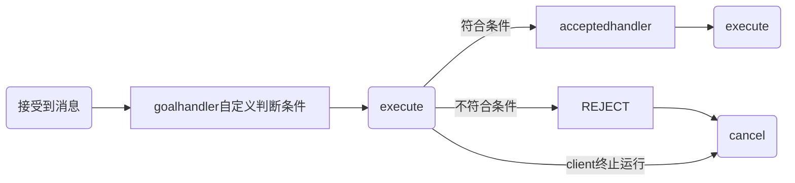

# ros2学习记录
需要注意在 `package.xml` 和 `CMakeLists.txt` 中声明所需要的依赖

---
## 创建自定义消息和服务
很恶心的一点就是,自定义的消息或者是服务的名称编译结束之后会变得不一样
引用的时候就会出现一些奇怪的bug
例如:
AddTwoInt.srv -> add_two_int.hpp & AddTwoInt
编译结束之后需要调用的头文件名称会不太一样,变成上面那种格式,但是在函数中调用的时候依旧是原来的定义的文件名的格式
`ros2 interface list` 利用这条指令来查看自己是否创建完成消息或者服务
文件名必须使文件名称中有大写字母，也就是最好使用**驼峰式命名**格式
文件中的数据类型必须生命位数，例如：`int64 int32 float32` 等

使用方需要注意包含特定的包
1. CMakeLists.txt 中 `find_package`
2. CMakeLists.txt 中 `ament_target_dependencies`
3. package.xml 中 `<depend>interfaces</depend>`

---
## topic
使用 `Publisher` 来发布话题消息
使用 `Subscription` 接受话题消息
需要注意的是
1. `publisher` 和 `subscription` 需要有相同的消息类型
2. `publisher` 和 `subscription` 需要有相同的消息名称

---
## service
使用 `service` 作为服务器
使用 `client` 作为客户端
客户端可以向服务器发送请求和数据，需要自己创建自定义的消息类型和服务
对于同一个服务器可以有多个客户端

---
## action
一定一定要添加依賴 `rclcpp_action`
其中 `actionserver` 比较复杂，需要应对多种信号来做处理
`actionclient` 也比较复杂，需要定义一个 `option` 绑定多种函数，也不是很建议使用 `timer`，感觉会有点冲突？

